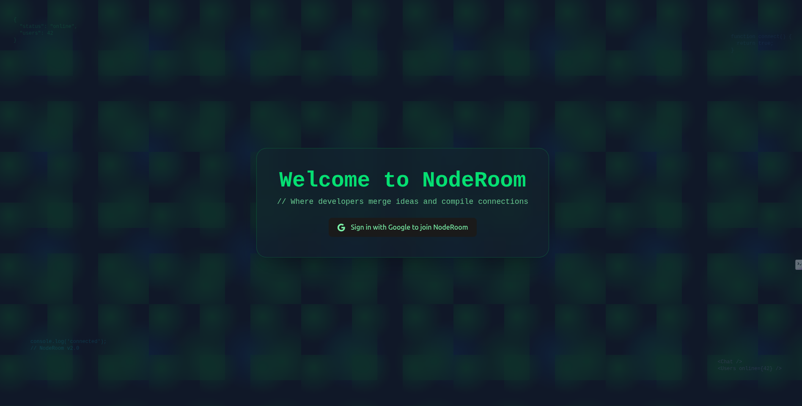
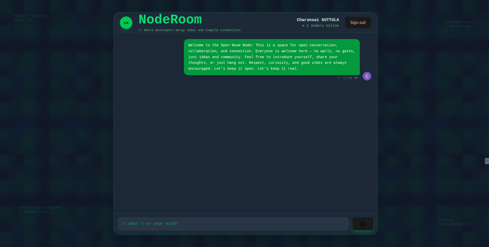

#  NodeRoom

NodeRoom is an **open chat app** where developers can connect, share ideas, and chat openly in real time.  
Built with **React, Supabase, TailwindCSS**, and **OAuth Authentication**, it provides a seamless and modern chat experience.

---

## 🌟 Features

- 🔑 **Google OAuth Authentication** (via Supabase Auth)
- 💬 **Open Chat Room** – No walls, no gates, just ideas and community
- ⚡ **Real-time messaging** with Supabase subscriptions
- 🎨 **Modern UI** built with TailwindCSS
- 🟢 **Online status & users count**
- 🌐 **Developer-themed design** (terminal-inspired interface)

---

## 🖥️ Screenshots

### Welcome Page


### Chat Room


---

## 🛠️ Tech Stack

- **Frontend**: [React](https://react.dev/) + [TailwindCSS](https://tailwindcss.com/)
- **Backend / Database**: [Supabase](https://supabase.com/)
- **Authentication**: Google OAuth (via Supabase Auth)
- **Deployment**: [Vercel](https://vercel.com/)

---

## ⚙️ Getting Started

Follow these steps to run NodeRoom locally:

### 1. Clone the Repository
```bash
git clone https://github.com/your-username/noderoom.git
cd noderoom
```

### 2. Install Dependencies
```bash
npm install
```

### 3. Setup Environment Variables
Create a `.env.local` file in the root directory with the following:

```env
NEXT_PUBLIC_SUPABASE_URL=your_supabase_url
NEXT_PUBLIC_SUPABASE_ANON_KEY=your_supabase_anon_key
```

### 4. Run the Development Server
```bash
npm run dev
```

Now visit 👉 [http://localhost:3000](http://localhost:3000)

---

## 🚢 Deployment

The project is live at: [https://node-room.vercel.app](https://node-room.vercel.app)

You can deploy NodeRoom easily on platforms like **Vercel**, **Netlify**, or **Render**.  
Make sure to add your Supabase environment variables in your hosting provider’s settings.

---

## 🤝 Contributing

Contributions, issues, and feature requests are welcome!  
Feel free to fork this project and submit a pull request.

---

## 📜 License

This project is licensed under the **MIT License**.

---

## 👨‍💻 Author

Developed by **Charansai GUTTULA** ✨  
*Where developers merge ideas and compile connections.*
